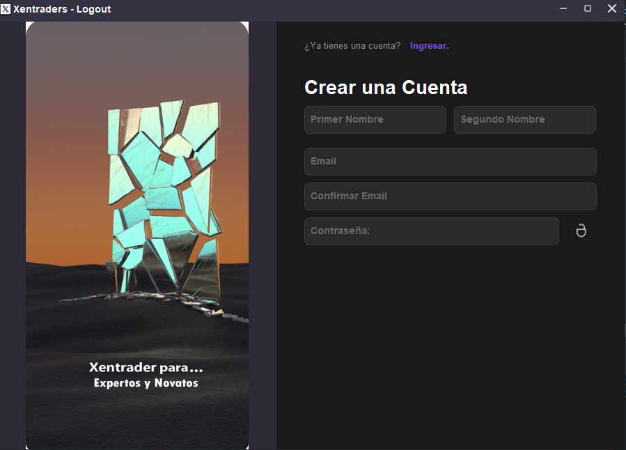

# 🤖 Xentrader Bot

<div align="center">


**Bot de Trading Automatizado y Manual con Interfaz Gráfica Moderna**

[](https://www.python.org/)
[](https://customtkinter.tomschimansky.com/)
[](LICENSE)
[]()

</div>

---

## 📋 Tabla de Contenidos

- [Descripción](#-descripción)
- [Características](#-características)
- [Capturas de Pantalla](#-capturas-de-pantalla)
- [Instalación](#-instalación)
- [Uso](#-uso)
- [Estructura del Proyecto](#-estructura-del-proyecto)
- [Tecnologías](#-tecnologías)
- [Autenticación](#-autenticación)
- [Configuración](#-configuración)
- [Contribuir](#-contribuir)
- [Licencia](#-licencia)
- [Contacto](#-contacto)

---

## 🎯 Descripción

**Xentrader Bot** es una plataforma completa de trading que combina automatización inteligente con control manual, diseñada para traders que buscan maximizar sus operaciones en el mercado forex. 

Con una interfaz gráfica moderna y elegante inspirada en aplicaciones profesionales como WhatsApp, el bot ofrece una experiencia de usuario intuitiva sin sacrificar funcionalidad avanzada.

### ¿Por qué Xentrader?

- 🎨 **Interfaz Moderna**: Diseño limpio y profesional con tema oscuro Catppuccin Mocha
- 🔒 **Seguridad Robusta**: Autenticación híbrida (local + online) con OAuth
- ⚡ **Alto Rendimiento**: Operaciones rápidas y eficientes
- 📊 **Análisis Completo**: Gráficos en tiempo real y análisis técnico
- 🤖 **Automatización Inteligente**: Bots configurables con estrategias personalizadas
- 🌐 **Modo Offline**: Funciona sin conexión a internet

---

## ✨ Características

### 🔐 Sistema de Autenticación

- ✅ **Autenticación Local**: Registro e inicio de sesión sin internet
- ✅ **OAuth Social**: Login con Google y Facebook
- ✅ **Modo Híbrido**: Funciona online y offline
- ✅ **Seguridad**: Contraseñas hasheadas con PBKDF2 (100,000 iteraciones)
- ✅ **Sincronización**: Datos locales se sincronizan automáticamente

### 📊 Dashboard Inteligente

- 💰 **Resumen Financiero**: Saldo total, ganancias/pérdidas en tiempo real
- 📈 **Vista de Mercado**: Precios actualizados y volúmenes
- ⚡ **Operaciones Rápidas**: Comprar, vender y cerrar posiciones con un clic
- 📉 **Posiciones Abiertas**: Monitoreo en vivo de tus trades

### 🎯 Trading Manual

- Ejecución manual de operaciones
- Análisis técnico en tiempo real
- Gestión de riesgos personalizada
- Stop Loss y Take Profit configurables

### 🤖 Trading Automático

- Estrategias predefinidas y personalizables
- Backtesting de estrategias
- Gestión automática de riesgo
- Logs detallados de operaciones

### 📈 Análisis y Gráficos

- Gráficos de velas en tiempo real
- Indicadores técnicos (MA, RSI, MACD, etc.)
- Análisis de tendencias
- Alertas de precios

### 🔔 Sistema de Alertas y Logs

- Notificaciones en tiempo real
- Historial completo de operaciones
- Logs del sistema
- Alertas personalizables

### ⚙️ Configuración Avanzada

- Personalización de estrategias
- Configuración de pares de divisas
- Ajustes de interfaz
- Gestión de API keys

---

## 📸 Capturas de Pantalla

### Login Screen


### Dashboard Principal
*Dashboard con resumen financiero y operaciones rápidas*

### Trading Automático
*Panel de configuración de bots y estrategias*

### Gráficos en Tiempo Real
*Análisis técnico con indicadores*

---

## 🚀 Instalación

### Prerrequisitos

- Python 3.12 o superior
- pip (gestor de paquetes de Python)
- Git

### Pasos de Instalación

1. **Clonar el repositorio**
```bash
git clone https://github.com/tu-usuario/xentraderBot.git
cd xentraderBot
```

2. **Crear entorno virtual** (recomendado)
```bash
python -m venv venv

# Windows
venv\Scripts\activate

# Linux/Mac
source venv/bin/activate
```

3. **Instalar dependencias**
```bash
pip install -r requirements.txt
```

4. **Configurar variables de entorno** (opcional)
```bash
cp config/secrets.example.json config/secrets.json
cp config/settings.example.json config/settings.json
```

5. **Ejecutar la aplicación**
```bash
python main.py
```

---

## 💻 Uso

### Primera Vez

1. **Registro**: Crea una cuenta con tu email o usa Google/Facebook
2. **Login**: Inicia sesión con tus credenciales
3. **Configuración**: Ajusta tus preferencias en el panel de configuración
4. **Trading**: ¡Comienza a operar!

### Modo Online

- Todas las funciones disponibles
- Sincronización automática
- OAuth activo

### Modo Offline

- Trading manual disponible
- Dashboard funcional
- Datos almacenados localmente
- Se sincroniza al recuperar conexión

### Operaciones Rápidas

```python
# Ejemplo de uso programático
from core.bot_thread import BotThread

bot = BotThread()
bot.start()

# Comprar
bot.buy(symbol="EURUSD", volume=0.1)

# Vender
bot.sell(symbol="EURUSD", volume=0.1)

# Cerrar posiciones
bot.close_all_positions()
```

---

## 📁 Estructura del Proyecto

```
xentraderBot/
├── auth/                      # Módulos de autenticación
│   ├── auth.py               # Funciones de auth básica
│   └── auth_config.py        # Configuración de auth
│
├── config/                    # Archivos de configuración
│   ├── pydracula.json        # Tema visual
│   ├── pythme.py             # Configuración de temas
│   ├── secrets.example.json  # Plantilla de secrets
│   └── settings.example.json # Plantilla de settings
│
├── core/                      # Núcleo de la aplicación
│   ├── bot_thread.py         # Thread principal del bot
│   └── mt5_manager.py        # Gestión de MetaTrader 5
│
├── gui/                       # Interfaz gráfica
│   ├── img/                  # Recursos visuales
│   │   ├── icons/           # Iconos de la UI
│   │   ├── img/             # Imágenes
│   │   └── png/             # Iconos PNG
│   ├── login_view.py        # Pantalla de login
│   ├── main_app.py          # Aplicación principal
│   ├── dashboard_view.py    # Vista del dashboard
│   ├── charts_view.py       # Vista de gráficos
│   └── auto_trading_view.py # Vista de trading auto
│
├── storage/                   # Almacenamiento local
│   ├── local_auth.py         # Sistema de auth local
│   ├── users.json           # Base de datos de usuarios
│   └── session.json         # Sesión actual
│
├── utils/                     # Utilidades
│   ├── auth.py              # Sistema de autenticación híbrido
│   └── loggers.py           # Sistema de logging
│
├── main.py                    # Punto de entrada
├── requirements.txt           # Dependencias
├── .gitignore                # Archivos ignorados por git
└── README.md                 # Este archivo
```

---

## 🛠️ Tecnologías

### Frontend

- **CustomTkinter 5.2.0+**: Framework para interfaces gráficas modernas
- **Pillow**: Procesamiento de imágenes
- **Pystray**: System tray notifications

### Backend

- **Python 3.12+**: Lenguaje principal
- **Supabase**: Base de datos y autenticación OAuth
- **Threading**: Procesamiento concurrente

### Seguridad

- **PBKDF2**: Hash de contraseñas
- **OAuth 2.0**: Autenticación social
- **Encriptación**: Protección de datos sensibles

### Análisis y Trading

- **MetaTrader 5**: Conexión con brokers
- **Pandas**: Análisis de datos
- **NumPy**: Cálculos numéricos

---

## 🔐 Autenticación

### Registro Local

```python
from utils.auth import sign_up

success, message = sign_up("usuario@email.com", "password123", "Usuario")
```

### Login Local

```python
from utils.auth import sign_in

success, message = sign_in("usuario@email.com", "password123")
```

### OAuth (Google/Facebook)

```python
from utils.auth import sign_in_with_provider

success, message = sign_in_with_provider("google")
```

### Verificar Sesión

```python
from utils.auth import is_logged_in, get_current_user

if is_logged_in():
    user = get_current_user()
    print(f"Usuario: {user['email']}")
```

### Cerrar Sesión

```python
from utils.auth import sign_out

sign_out()
```

Para más detalles, consulta [AUTH_IMPLEMENTATION.md](AUTH_IMPLEMENTATION.md)

---

## ⚙️ Configuración

### Secrets (config/secrets.json)

```json
{
  "supabase": {
    "url": "tu_supabase_url",
    "key": "tu_supabase_key"
  },
  "mt5": {
    "login": "tu_login",
    "password": "tu_password",
    "server": "tu_servidor"
  }
}
```

### Settings (config/settings.json)

```json
{
  "theme": "dark",
  "language": "es",
  "auto_sync": true,
  "trading": {
    "default_volume": 0.1,
    "max_positions": 5,
    "risk_percent": 2.0
  }
}
```

---

## 🧪 Testing

### Ejecutar Tests

```bash
# Test de autenticación
python test_auth.py

# Modo interactivo
python test_auth.py
# Selecciona opción 2
```

### Tests Disponibles

- ✅ Registro de usuario
- ✅ Inicio de sesión
- ✅ Verificación de sesión
- ✅ Cierre de sesión
- ✅ Modo offline
- ✅ Sincronización

---

## 🤝 Contribuir

¡Las contribuciones son bienvenidas! Sigue estos pasos:

1. **Fork** el proyecto
2. **Crea una rama** para tu feature (`git checkout -b feature/AmazingFeature`)
3. **Commit** tus cambios (`git commit -m 'Add: AmazingFeature'`)
4. **Push** a la rama (`git push origin feature/AmazingFeature`)
5. **Abre un Pull Request**

### Guía de Estilo

- Usa nombres descriptivos para variables y funciones
- Comenta código complejo
- Sigue PEP 8
- Escribe tests para nuevas features

---

## 📝 Changelog

### v2.0.0 (2025-01-15)

- ✨ Nueva interfaz gráfica moderna
- 🔐 Sistema de autenticación híbrido
- 📊 Dashboard mejorado
- 🤖 Trading automático optimizado
- 🌐 Modo offline completo

### v1.5.0 (2024-12-10)

- 🎨 Rediseño de UI
- 🔒 Mejoras de seguridad
- 📈 Nuevos indicadores técnicos

### v1.0.0 (2024-11-01)

- 🚀 Lanzamiento inicial

---

## 📄 Licencia

Este proyecto está bajo la Licencia MIT - ver el archivo [LICENSE](LICENSE) para más detalles.

```
MIT License

Copyright (c) 2025 Xentraders

Se concede permiso, de forma gratuita, a cualquier persona que obtenga una copia
de este software y archivos de documentación asociados (el "Software"), para 
utilizar el Software sin restricción, incluyendo sin limitación los derechos
de usar, copiar, modificar, fusionar, publicar, distribuir, sublicenciar, y/o 
vender copias del Software, y permitir a las personas a las que se les 
proporcione el Software hacer lo mismo, sujeto a las siguientes condiciones...
```

---

## 📞 Contacto

### Soporte

- 📧 Email: support@xentraders.com
- 💬 Discord: [Servidor Xentraders](https://discord.gg/xentraders)
- 🐦 Twitter: [@XentradersBot](https://twitter.com/XentradersBot)

### Equipo

- **Lead Developer**: [Tu Nombre](https://github.com/jhersara)
- **UI/UX Designer**: [Diseñador](https://github.com/jhersara)
- **Trading Expert**: [Experto](https://github.com/jhersara)

### Links Útiles

- 🌐 [Website](https://xentraders.com)
- 📚 [Documentación](https://docs.xentraders.com)
- 🐛 [Reportar Bug](https://github.com/jhersara/xentraderBot/issues)
- 💡 [Solicitar Feature](https://github.com/jhersara/xentraderBot/issues/new)

---

## 🎓 Recursos de Aprendizaje

### Tutoriales

- [Guía de Inicio Rápido](docs/quickstart.md)
- [Configuración Avanzada](docs/advanced-config.md)
- [Crear Estrategias Personalizadas](docs/custom-strategies.md)
- [API Reference](docs/api-reference.md)

### Videos

- [Instalación Paso a Paso](https://youtube.com/watch?v=ejemplo)
- [Trading Manual](https://youtube.com/watch?v=ejemplo)
- [Configurar Bots](https://youtube.com/watch?v=ejemplo)

---

## ⚠️ Disclaimer

**IMPORTANTE**: El trading de divisas (Forex) conlleva un alto nivel de riesgo y puede no ser adecuado para todos los inversores. Este software es solo para fines educativos e informativos.

- ⚠️ **Riesgo de Pérdida**: Puede perder todo su capital invertido
- 📚 **Educación**: Aprenda antes de operar con dinero real
- 🧪 **Demo**: Use cuentas demo para practicar
- 💰 **Responsabilidad**: Las decisiones de trading son su responsabilidad

**Los desarrolladores de Xentrader Bot no se hacen responsables de las pérdidas incurridas al usar este software.**

---

## 🌟 Agradecimientos

Queremos agradecer a:

- CustomTkinter por el excelente framework de UI
- Supabase por la infraestructura de backend
- La comunidad de trading por su feedback
- Todos los contribuidores del proyecto

---

## 📊 Estadísticas del Proyecto


---

<div align="center">

**Hecho con ❤️ por el equipo de Xentraders**

[⬆ Volver arriba](#-xentrader-bot)

</div>
