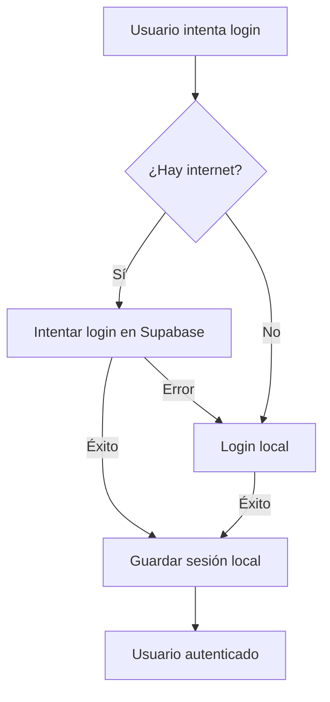

# Sistema de Autenticación Híbrido (Online/Offline)

## Características

✅ **Autenticación Local**: Registra e inicia sesión sin conexión a internet
✅ **Autenticación Online**: Conecta con Supabase cuando hay internet
✅ **OAuth Social**: Login con Google y Facebook (requiere conexión)
✅ **Sincronización Automática**: Los datos locales se sincronizan cuando hay conexión
✅ **Seguridad**: Las contraseñas se hashean con PBKDF2 y salt

## Cómo Funciona

### Modo Online
- Al registrarte o iniciar sesión con internet, los datos se guardan en Supabase
- Se crea una copia local automáticamente para uso offline

### Modo Offline
- Puedes registrarte e iniciar sesión sin internet
- Los datos se guardan de forma segura en archivos locales encriptados
- Cuando recuperes la conexión, se sincronizarán automáticamente

### Almacenamiento Local
Los datos se guardan en:
- `storage/users.json`: Usuarios registrados (contraseñas hasheadas)
- `storage/session.json`: Sesión activa del usuario

⚠️ **Nota**: Estos archivos están en `.gitignore` para proteger tu privacidad

## Uso en el Código

### Registro
```python
from utils.auth import sign_up

# Funciona online y offline
success, message = sign_up("usuario@email.com", "contraseña123", "Usuario")
if success:
    print("Usuario creado:", message)
```

### Inicio de Sesión
```python
from utils.auth import sign_in

# Intenta online primero, luego fallback a offline
success, message = sign_in("usuario@email.com", "contraseña123")
if success:
    print("Login exitoso:", message)
```

### Login Social (Google/Facebook)
```python
from utils.auth import sign_in_with_provider

# Requiere conexión a internet
success, message = sign_in_with_provider("google")
if success:
    print("Login con Google exitoso")
```

### Verificar Usuario Actual
```python
from utils.auth import get_current_user, is_logged_in

if is_logged_in():
    user = get_current_user()
    print(f"Usuario: {user['email']}")
```

### Cerrar Sesión
```python
from utils.auth import sign_out

success, message = sign_out()
```

## Seguridad

- Las contraseñas NUNCA se guardan en texto plano
- Se usa PBKDF2 con 100,000 iteraciones
- Cada contraseña tiene su propio salt único
- Los archivos de almacenamiento están excluidos de Git

## Sincronización

Para sincronizar usuarios locales con Supabase:
```python
from utils.auth import sync_pending_users

success, message = sync_pending_users()
print(message)  # "X usuarios sincronizados"
```

## Estructura del Proyecto

```
xentraderBot/
├── storage/
│   ├── __init__.py
│   ├── local_auth.py          # Sistema de autenticación local
│   ├── users.json             # Usuarios registrados (git-ignored)
│   └── session.json           # Sesión actual (git-ignored)
├── utils/
│   └── auth.py                # Funciones de autenticación híbrida
└── gui/
    └── login_view.py          # Interfaz de usuario
```

## Notas Importantes

1. **Modo Offline**: Perfecto para trabajar sin internet
2. **Sincronización**: Los datos se sincronizan automáticamente al conectarte
3. **Seguridad**: Las contraseñas están protegidas con hash + salt
4. **OAuth**: Google y Facebook requieren conexión a internet
5. **Persistencia**: La sesión se mantiene incluso al cerrar la aplicación

## Flujo de Autenticación



## Requisitos

```bash
pip install supabase
```

¡Listo! Ahora tu aplicación puede funcionar tanto online como offline.
